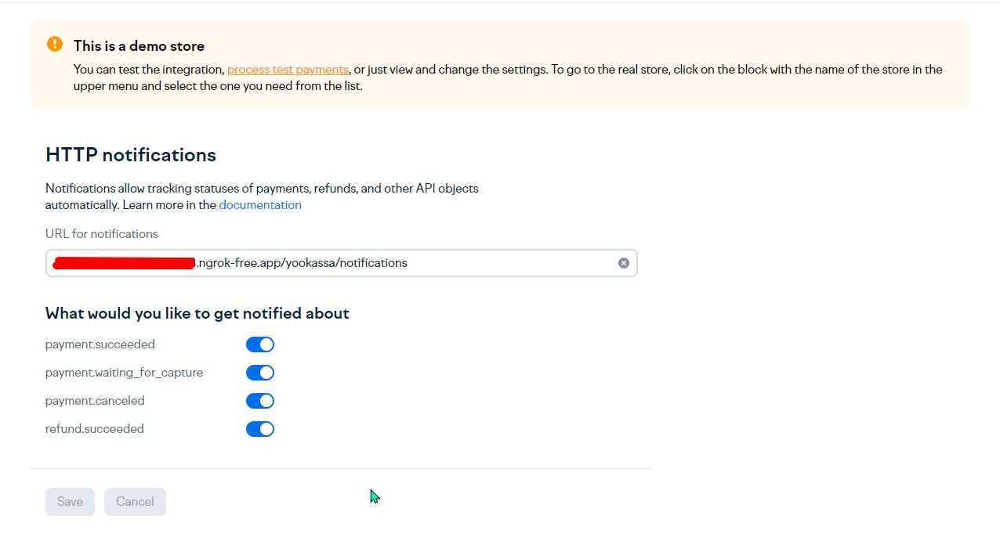

# YooKassa Laravel

## Installing

```bash
composer require digkill/yookassa-laravel
```

```bash
php artisan vendor:publish --tag=yookassa.migrations
php artisan migrate
```

```bash
php artisan vendor:publish --tag=yookassa.config
```

```bash
php artisan vendor:publish --provider=Digkill\YooKassaLaravel\YooKassaServiceProvider
```

```php
// Facade
use Digkill\YooKassaLaravel\Facades\YooKassaFacade;
$yookassaPayment = YookassaFacade::createPayment(10000, 'test payment'); 

// Service
$service = app(Digkill\YooKassaLaravel\Services\PaymentService::class);
$yookassaPayment = $service->createPayment(10000, 'test payment');
```


To receive the request you need to add a URL



And subscribe to the event Digkill\YooKassaLaravel\Events\YookassaPaymentNotification

```php
namespace App\Providers;
class EventServiceProvider extends ServiceProvider
...
    protected $listen = [
        YookassaPaymentNotification::class => [
        YookassaPaymentStatus::class
    ]
];
...
```

```php
namespace App\Listeners;
class YookassaPaymentStatus implements ShouldQueue
...
public function handle(YookassaPaymentNotification $event): void
{
    if ($event->payment->status === PaymentStatus::SUCCEEDED->value) {
    }
}
```
### If you use doctrine, the entity is located in the Entities folder

### .env
```bash
YOOKASSA_SHOP_ID=
YOOKASSA_SECRET_KEY=
YOOKASSA_REDIRECT=
```

### Use notifications

```php
        $yooKassa = new YooKassa([]);
        $paymentRepository = new PaymentRepository();
        $paymentService = new PaymentService($yooKassa, $paymentRepository);

        $requestBody = $request->all();
        if (!isset($requestBody['event'])) {
            throw new \Exception('event not found');
        }

        if (($requestBody['event'] === NotificationEventType::PAYMENT_SUCCEEDED)) {
            $notification = new NotificationSucceeded($requestBody);
        } elseif ($requestBody['event'] === NotificationEventType::PAYMENT_WAITING_FOR_CAPTURE) {
            $notification = new NotificationWaitingForCapture($requestBody);
        } else {
            $notification = new NotificationCanceled($requestBody);
        }

        $payment = $notification->getObject();
        $status = PaymentStatus::tryFrom($payment->getStatus());
        $paymentService->setStatus($payment->getId(), $status);
        $yooKassaPayment = $paymentService->findByPaymentId($payment->getId());
        YookassaPaymentNotification::dispatch($yooKassaPayment);

        return response()->json();
```

# MIT License

Copyright (c) 2024 Vitaliy Edifanov

Permission is hereby granted, free of charge, to any person obtaining a copy
of this software and associated documentation files (the "Software"), to deal
in the Software without restriction, including without limitation the rights
to use, copy, modify, merge, publish, distribute, sublicense, and/or sell
copies of the Software, and to permit persons to whom the Software is
furnished to do so, subject to the following conditions:

The above copyright notice and this permission notice shall be included in all
copies or substantial portions of the Software.

THE SOFTWARE IS PROVIDED "AS IS", WITHOUT WARRANTY OF ANY KIND, EXPRESS OR
IMPLIED, INCLUDING BUT NOT LIMITED TO THE WARRANTIES OF MERCHANTABILITY,
FITNESS FOR A PARTICULAR PURPOSE AND NONINFRINGEMENT. IN NO EVENT SHALL THE
AUTHORS OR COPYRIGHT HOLDERS BE LIABLE FOR ANY CLAIM, DAMAGES OR OTHER
LIABILITY, WHETHER IN AN ACTION OF CONTRACT, TORT OR OTHERWISE, ARISING FROM,
OUT OF OR IN CONNECTION WITH THE SOFTWARE OR THE USE OR OTHER DEALINGS IN THE
SOFTWARE.
